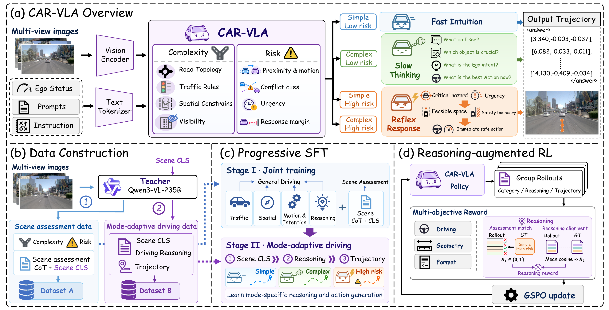

<div align="center">

<h1>&nbsp; CAR-VLA</h1>
<h3>Complexity-Aware and Risk-Adaptive Reasoning<br>for Autonomous Driving</h3>

<p>
Xiaolei Chen<sup>1</sup>, Zhuolin He<sup>1,2,†</sup>, Yuxuan Liang<sup>1</sup>, Xu Li<sup>1</sup>, Haotian Chen<sup>1</sup>, Shi Fan<sup>3</sup>, Mengyang Zhao<sup>1</sup>,<br>
Wenjuan Meng<sup>1</sup>, Zisheng Chen<sup>4</sup>, Zhihao Zhu<sup>2</sup>, Zhounan Jin<sup>5</sup>, Hengli Wang<sup>5</sup>,<br>
Qingfan Wang<sup>2</sup>, Jiamei Liang<sup>2</sup>, Bin Li<sup>1</sup>, Xiangyang Xue<sup>1,✉</sup>
</p>

<p>
<sup>1</sup> Fudan University &nbsp; <sup>2</sup> Yinwang Intelligent Technology Co., Ltd<br>
<sup>3</sup> Fuzhou University &nbsp; <sup>4</sup> Sun Yat-Sen University &nbsp; <sup>5</sup> Huawei Technology
</p>

<p><sup>†</sup> Projector leader. &nbsp; <sup>✉</sup> Corresponding author.</p>

<p>
<a href="https://arxiv.org/abs/2609.34387"></a>
<a href="#method"></a>
<a href="#todo-list"></a>
</p>

<p><b>One driving model. Three reasoning modes. Guided by complexity and risk.</b></p>

</div>

Official repository for **CAR-VLA: Complexity-Aware and Risk-Adaptive Reasoning for Autonomous Driving**.

> **Code is coming soon.** We are preparing the implementation for release. This repository currently provides the project overview, paper figure, and release scaffold.

[News](#news) · [Overview](#overview) · [Method](#method) · [Results](#results) · [Todo List](#todo-list) · [Citation](#citation) · [Acknowledgments](#acknowledgments)

## News

- **2026-10-01:** Our paper is available on [arXiv](https://arxiv.org/abs/2609.34387)!
- **2026-09-28:** The CAR-VLA repository is now available with the project overview and method figure. Code is coming soon!

## Paper

**CAR-VLA: Complexity-Aware and Risk-Adaptive Reasoning for Autonomous Driving**

[Read on arXiv](https://arxiv.org/abs/2609.34387) · [Paper PDF](https://arxiv.org/pdf/2609.34387)

## Overview

Driving situations differ in both scene complexity and dynamic risk. CAR-VLA is a unified Vision-Language-Action model that uses these two dimensions to adapt the **depth, urgency, and focus** of its reasoning before generating a driving trajectory.

CAR-VLA maps four complexity-risk categories to three reasoning modes:

| Scene complexity | Dynamic risk | Reasoning mode | Behavior |
| :--- | :--- | :--- | :--- |
| Simple | Low | **Fast Intuition** | Generate the trajectory directly, without explicit driving reasoning. |
| Complex | Low | **Slow Thinking** | Deliberate over the scene and driving decision. |
| Simple or complex | High | **Reflex Response** | Focus compact reasoning on the critical hazard and immediate safe response. |

Reflex Response organizes reasoning around **Hazard, Urgency, Feasibility, Constraint, and Action**. The two high-risk scene categories remain distinct labels while sharing the same reasoning mode.

## Method

<p align="center">
  <a href="assets/method.pdf">
    
  </a>
</p>

<p align="center"><a href="assets/method.pdf">View the method figure as a vector PDF</a></p>

1. **Complexity-risk guided data construction.** A teacher model produces scene assessment annotations and mode-adaptive driving annotations.
2. **Progressive supervised fine-tuning.** Stage I jointly learns general driving knowledge and scene assessment. Stage II learns scene classification, mode-specific reasoning, and trajectory generation.
3. **Reasoning-augmented reinforcement learning.** GSPO optimizes driving, geometry, and reasoning rewards under a format gate. The reasoning reward combines scene-category correctness with section-wise alignment to reference reasoning.

At inference time, a single autoregressive policy generates the scene category, the corresponding driving reasoning when needed, and the trajectory.

## Results

Selected results reported in the manuscript:

| Benchmark | Split | Model | Metric ↑ | Score |
| :--- | :--- | :--- | :--- | ---: |
| NAVSIM v1 | Navtest | CAR-VLA-RL | PDMS | **91.1** |
| NAVSIM v2 | Navtest | CAR-VLA-RL | EPDMS | **90.3** |
| NAVSIM v2 | Navhard | CAR-VLA | EPDMS | **35.0** |

Higher is better. These scores follow the manuscript's respective benchmark protocols; PDMS and EPDMS are different metrics.

## Todo List

- [x] Publish the project overview and method figure.
- [x] Add the arXiv paper link.
- [ ] **Code is coming soon**: release the cleaned CAR-VLA implementation.
- [ ] Add environment setup and data preparation instructions.
- [ ] Add training, inference, and evaluation scripts and configurations.

## Repository Structure

```text
CAR-VLA/
├── README.md            # Project overview and release status
├── assets/              # CAR-VLA mascot and paper method figure
├── car_vla/             # Reserved for the CAR-VLA implementation
├── configs/             # Reserved for experiment configurations
├── scripts/             # Reserved for data, training, and evaluation entry points
└── docs/                # Documentation and release guide
```

The implementation directories currently contain release notes only. Installation requirements and runnable commands will be added with the code release.

## Citation

If you find CAR-VLA useful for your research, please cite our work.

```bibtex
@misc{chen2026carvla,
  title  = {{CAR-VLA}: Complexity-Aware and Risk-Adaptive Reasoning for Autonomous Driving},
  author = {Chen, Xiaolei and He, Zhuolin and Liang, Yuxuan and Li, Xu and
            Chen, Haotian and Fan, Shi and Zhao, Mengyang and Meng, Wenjuan and
            Chen, Zisheng and Zhu, Zhihao and Jin, Zhounan and Wang, Hengli and
            Wang, Qingfan and Liang, Jiamei and Li, Bin and Xue, Xiangyang},
  year   = {2026},
  eprint = {2609.34387},
  archivePrefix = {arXiv},
  primaryClass = {cs.CV},
  url    = {https://arxiv.org/abs/2609.34387}
}
```

## Acknowledgments

We gratefully acknowledge the authors and contributors of the following open-source projects. Their code and tools provide valuable foundations for this work:

- **[AutoVLA](https://github.com/ucla-mobility/AutoVLA)**: a driving VLA framework with adaptive reasoning and reinforcement fine-tuning.
- **[EasyR1](https://github.com/hiyouga/EasyR1)**: an efficient, scalable framework for multimodal reinforcement learning.
- **[NAVSIM](https://github.com/autonomousvision/navsim)**: autonomous-driving simulation, benchmarks, and evaluation tools.

Please also cite these projects when using their code and resources. Their upstream BibTeX entries are collected in [docs/references.bib](docs/references.bib); refer to the linked repositories for the latest citation instructions.
